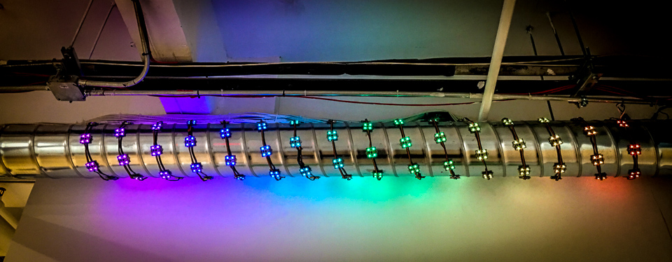

# ⚡ The ThunderTube ⚡

[](https://www.youtube.com/watch?v=gyQX5rhEqEg)
[(watch it in action)](https://www.youtube.com/watch?v=gyQX5rhEqEg)

# Overview
An application for live-coding some LEDs in the Recurse Center space.

The application has three components:
 - Javascript client: for sending websocket data for lights
 - A server on a teensy board for handling websocket connection and powering lights
 - A MongoDB server for persisting code
 
There is an additional branch called `simulator` which has a 3D simulator written in THREE.js that you can access online at `thundertube.now.sh`.
(Maintained by @strickinato)

It's all run on a raspberry pi on the Recurse LAN. (pi@thundertube.local)

## Get it running

```
npm install
node server/index.js
```

Now go to http://localhost:5000

# The Client

## Dependencies

The client uses [code mirror](https://codemirror.net/) for the editor. For the client dependencies, we don't use a build script and instead they're directly referenced from the the source code in client/lib directory. See the `index.html` for how they're included.
  
  
# The Teensy Board  

## About

The hardware is a prototype of Max D's (F2'18) [LEDRiver](https://github.com/maxdee/ledriver) project - which is based around a Teensy3.2 board.

## Programming the board
(Done on Mac v10.13.16)

Install the arduino editor. Then install the teensy extension

Go to Tools → Manage Libraries, then search for and install SSD1306Ascii
Then, in /Applications/Arduino.app/Contents/Java/libraries/, delete Ethernet/ and SD/

Install the following in ~/Documents/Arduino/libraries/:
* https://github.com/chrisstaite/TeensyDmx
* https://github.com/brandenhall/Arduino-Websocket
* https://github.com/bblanchon/ArduinoJson
* https://github.com/sstaub/TeensyID

Now open the Arduino IDE, and select Tools → Board → "Teensy 3.2"

## Troubleshooting

* There are many modes. A button on the side controls what mode we're in. Thundertube expects "websocket control mode"!
* Try unplugging and plugging back in!

# The saved code server

This is hosted on mongo.

# The Raspberry Pi

The raspberry pi by default has [LXDE](http://lxde.org), a linux distro that is heavily built around the Desktop Manager [Open Box](http://openbox.org/wiki/Main_Page). In order to set it up to launch our page right away, we took some of the following common raspberry pi steps.

## Useful shortcuts provided by openbox

* `alt+f4` - close window
* `alt+ctrl+f1` - jump out of Desktop Manager to TTY
* Right click on things - the context menus are great

## Setup Hostname:
You should be able to find this Raspberry Pi on the Recurse Network. It's called `thundertube` This is done by simply editing `/etc/hostname`.

## Enable SSH
This means you can SSH into the pi if you're on the Recurse Center network. Use `ssh pi@thundertube.local` The password for the pi user is the same as the password for the Recurse Center network.

Enabling SSH on raspberry pi's can be done by adding a file named `ssh` to the root directory.

## Boot without login
As soon as the raspberry pi boots, it should launch our page. This is accomplished by running our startup script

1. `sudo raspi-config` > Boot Options > Desktop / CLI > Desktop AutoLogin
2. Edit `~/.config/lxsession/LXDE/autostart`

```
# These prevent screen from turning off
@xset s off
@xset -dpms
@xset s noblank
/home/pi/thundertube/startup.sh
```
